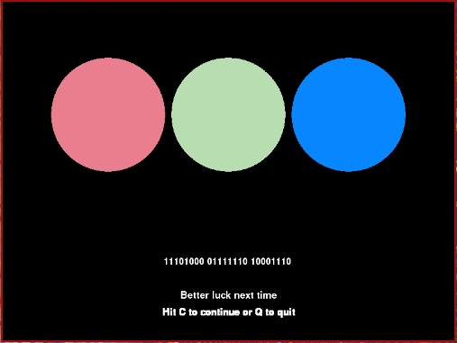

# CSCI 1300 - What The Bin
This “game” displays three circles of different colors and a binary code which
is equivalent to one of the colors of the three circles that are displayed. I
used pygame to have a graphical interface and have user interaction outside of
the command line.

## Decimal to Binary
Pygame uses regular decimal numbers (from 0 to 255) to represent specific values
of red, green, or blue. So I had to come up with a method to change those values
into binary numbers. First, I started using a bunch of “if else” statements to
compute each digit in the binary equivalent of the red, green, or blue value.
But after I’d typed it all out, I realized I could do it with a for loop that
took up a lot less lines and made the program a lot more readable.

## What it does
Every instance of this game generates random colors for the three different
circles and the binary code that is displayed is also randomly picked between
the three different displayed circles. All that the user has to do is try to
figure out which color is represented by the binary code that is shown and then
click on the circle that they think is the correct answer. The user would have
to know that the colors in computers are made up of Red, Green, and Blue. He or
she would also have to know that each color is represented by any one of 256
values, and that the higher the value gets, the brighter the color gets. Once
the user interacts, there is also the option of either quitting or continuing on
to the next set of colors.

## How to play
All the user has to do once the game is running is to click on the circle which
he/she thinks corresponds to the binary number. If the user chooses correctly
the user will get a praise, otherwise the user doesn’t get praised... Once the
user has made his/her choice, they are free to hit “c” to continue or “q” to
quit. If the user chooses to continue, he/she gets a new set of circles with a
new corresponding binary number and the process is repeated. Otherwise, the
program quits out. That’s all folks.
